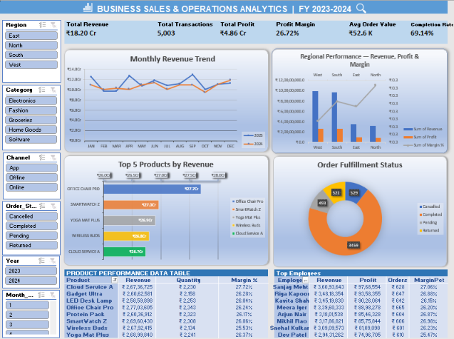

# Sales Performance Analysis – Excel Project

## Project Overview

An Excel-based Sales Performance Analysis project designed to analyze sales performance, product performance, order fulfillment, sales channels, and employee performance using Microsoft Excel.

## Business Objectives

- Analyze overall sales performance
- Identify top-performing products
- Analyze revenue across different sales channels
- Monitor order fulfillment status
- Evaluate employee performance
- Calculate key business performance KPIs

## Tools & Excel Features Used

- Microsoft Excel
- Excel Tables
- Pivot Tables
- Pivot Charts
- Slicers & Filters
- Conditional Formatting
- Data Validation
- SUM, AVERAGE, COUNT
- IF, AND, OR
- SUMIF, SUMIFS
- COUNTIF, COUNTIFS
- AVERAGEIF, AVERAGEIFS
- VLOOKUP
- XLOOKUP
- INDEX & MATCH
- IFERROR
- UNIQUE
- FILTER
- SORT
- SUMPRODUCT

## Key KPIs

- Total Sales
- Total Orders
- Total Quantity
- Average Order Value
- Completion Rate
- Top 5 Products by Revenue

## Dashboard Features

The interactive Excel dashboard provides insights into:

- Sales performance
- Top 5 products by revenue
- Order fulfillment status
- Sales channel performance
- Product performance
- Employee performance
- Revenue, orders, quantity, and margin analysis

## Dashboard Preview

## Data Analysis

The project uses Excel formulas, Pivot Tables, Pivot Charts, filters, and dynamic functions to transform raw sales data into meaningful business insights.

## Project Highlights

- Built an interactive Excel sales dashboard
- Performed data cleaning and validation
- Created dynamic summaries using Excel formulas
- Used Pivot Tables and Pivot Charts for analysis
- Created KPI calculations for business performance
- Analyzed product and employee performance

## Project File

The complete Excel workbook is available in this repository.

## Author

Amar Apraj
